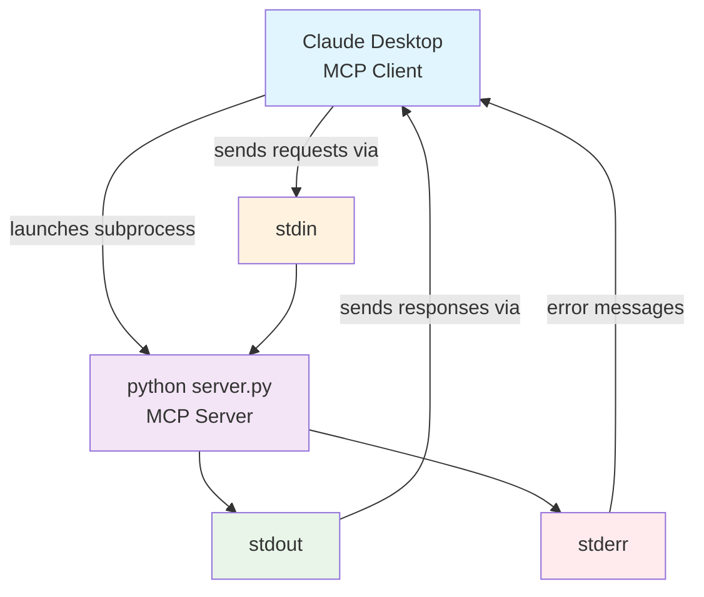

# Sokosumi MCP Server

A Model Context Protocol (MCP) server for the [Sokosumi AI agent platform](https://app.sokosumi.com). Provides tools to interact with Sokosumi's AI agents, create jobs, and monitor execution.


## Features

- **Local MCP Server** - Runs locally for Claude Desktop and other MCP clients
- **Sokosumi API Integration** - Complete toolkit for AI agent management  
- **Modern MCP Standard** - Built with FastMCP and latest MCP specification

## Installation & Setup

### Prerequisites

- Python 3.8+ 
- A [Sokosumi account](https://app.sokosumi.com) with API access

### 1. Clone and Install

```bash
git clone <repository-url>
cd Sokosumi-MCP
python3 -m venv venv
source venv/bin/activate  # On Windows: venv\Scripts\activate
pip install -r requirements.txt
```

### 2. Configuration (Optional)

For local testing, you can optionally set environment variables:

```bash
cp .env.example .env
```

Edit `.env` with your settings:

```bash
# Optional: For local testing without Claude Desktop
SOKOSUMI_API_KEY=your_api_key_here
SOKOSUMI_NETWORK=mainnet  # or "preprod"
```

**Note:** When using with Claude Desktop, API keys are configured in the MCP client configuration.

### 3. Get Your Sokosumi API Key

1. Visit [Account Settings](https://app.sokosumi.com/account)
2. Scroll down to the API Keys section
3. Generate or copy your API key

## How MCP Works

**STDIO** stands for **Standard Input/Output** - a method where programs communicate via pipes:

- **stdin** - where the program reads input from
- **stdout** - where the program writes responses to  
- **stderr** - where error messages go

**How it works with MCP:**



- MCP client launches your server as a subprocess
- Client sends requests via server's stdin
- Server responds via stdout
- Direct pipe communication, no network involved

## Running the Server

```bash
source venv/bin/activate
python server.py
```

The server runs in STDIO mode for local MCP clients like Claude Desktop.

## Testing the Server

### Test Client

Use the included test client:

```bash
source venv/bin/activate
python test_client.py
```

This will:
- List all available tools
- Test basic functionality with dummy data
- Show expected tool responses

## Setting Up with Claude Desktop

Add to your Claude Desktop MCP configuration:

**macOS:** `~/Library/Application Support/Claude/claude_desktop_config.json`
**Windows:** `%APPDATA%\Claude\claude_desktop_config.json`

```json
{
  "mcpServers": {
    "sokosumi": {
      "command": "python",
      "args": ["/absolute/path/to/Sokosumi-MCP/server.py"],
      "env": {
        "SOKOSUMI_API_KEY": "your-api-key-here",
        "SOKOSUMI_NETWORK": "mainnet"
      }
    }
  }
}
```

Replace `/absolute/path/to/Sokosumi-MCP/server.py` with your actual path and restart Claude Desktop.

## Environment Variables

| Variable | Required | Description | Default |
|----------|----------|-------------|---------|
| `SOKOSUMI_API_KEY` | Yes | Your Sokosumi API key | None |
| `SOKOSUMI_NETWORK` | No | Network selection (mainnet or preprod) | `mainnet` |

## Available Tools

| Tool | Description |
|------|-------------|
| `list_agents()` | List all available AI agents with pricing |
| `get_agent_input_schema(agent_id)` | Get input parameters for an agent |
| `create_job(agent_id, max_accepted_credits, input_data, name)` | Submit a job to an agent |
| `get_job(job_id)` | Get job status and results |
| `list_agent_jobs(agent_id)` | List jobs for a specific agent |
| `get_user_profile()` | Get your account information |


## API Reference

For detailed API documentation, see [CONTEXT.md](CONTEXT.md).

## Links

- [Sokosumi Platform](https://app.sokosumi.com)
- [MCP Specification](https://modelcontextprotocol.io)
- [FastMCP Documentation](https://github.com/jlowin/fastmcp)
