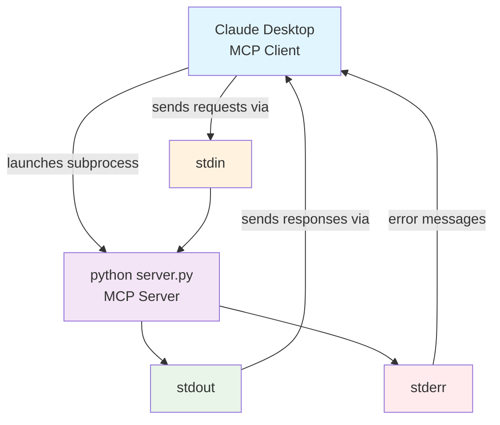

# Sokosumi MCP Server

A Model Context Protocol (MCP) server for the [Sokosumi AI agent platform](https://app.sokosumi.com). Provides tools to interact with Sokosumi's AI agents, create jobs, and monitor execution.

## Quick Deploy

Deploy your own instance in one click:

[](https://railway.com/deploy/sokosumi-mcp?referralCode=Y5EMKa&utm_medium=integration&utm_source=template&utm_campaign=generic)

You'll need your Sokosumi API key during deployment. Get it from [Account Settings](https://app.sokosumi.com/account) (scroll down to API Keys section).

## Features

- **Remote MCP Server** - Runs on cloud platforms (Railway, Cloud Run, etc.)
- **Dual Transport Support** - STDIO for local development, HTTP for remote deployment
- **Sokosumi API Integration** - Complete toolkit for AI agent management
- **Auto Parameter Extraction** - API keys and network settings from URL parameters
- **Modern MCP Standard** - Built with FastMCP and latest MCP specification

## Installation & Setup

### Prerequisites

- Python 3.8+ 
- A [Sokosumi account](https://app.sokosumi.com) with API access

### 1. Clone and Install

```bash
git clone <repository-url>
cd Sokosumi-MCP
python3 -m venv venv
source venv/bin/activate  # On Windows: venv\Scripts\activate
pip install -r requirements.txt
```

### 2. Configuration

Copy the example environment file:

```bash
cp .env.example .env
```

Edit `.env` with your settings:

```bash
# For local testing only (optional)
SOKOSUMI_API_KEY=your_api_key_here
SOKOSUMI_NETWORK=mainnet  # or "preprod"

# For remote deployment (Railway/Cloud Run)
# PORT=8000  # Uncomment to enable HTTP mode
```

**Important:** In production, API keys are passed via URL parameters, not environment variables.

### 3. Get Your Sokosumi API Key

1. Visit [Account Settings](https://app.sokosumi.com/account)
2. Scroll down to the API Keys section
3. Generate or copy your API key

## Understanding Transport Modes

This server supports two transport modes depending on how you run it:

### STDIO Transport (Local Development)

**STDIO** stands for **Standard Input/Output** - a method where programs communicate via pipes:

- **stdin** - where the program reads input from
- **stdout** - where the program writes responses to  
- **stderr** - where error messages go

**How it works with MCP:**



- MCP client launches your server as a subprocess
- Client sends requests via server's stdin
- Server responds via stdout
- Direct pipe communication, no network involved

### HTTP Transport (Remote Deployment)

- Server runs as a web service
- Communication happens over HTTP/HTTPS
- Used for remote deployment on Railway, Cloud Run, etc.
- Clients connect via network requests

## Running the Server

### Local Development (STDIO Mode)

```bash
source venv/bin/activate
python server.py
```

The server automatically uses STDIO mode when no `PORT` environment variable is set.

### Remote Deployment (HTTP Mode)

Set the `PORT` environment variable to enable HTTP mode:

```bash
export PORT=8000
python server.py
```

Or deploy to Railway/Cloud platforms - they automatically set `PORT`.

## Testing the Server

### Option 1: Test Client (Local STDIO)

Use the included test client:

```bash
source venv/bin/activate
python test_client.py
```

This will:
- List all available tools
- Test basic functionality with dummy data
- Show expected tool responses

### Option 2: Manual Testing (HTTP Mode)

Test the remote HTTP endpoint:

```bash
# Update the test script with your Railway URL and API key
./test_remote.sh https://your-app.railway.app your-api-key
```

### Option 3: MCP Client Integration

#### Claude Desktop (Local)

Add to your MCP configuration:

```json
{
  "mcpServers": {
    "sokosumi": {
      "command": "python",
      "args": ["/path/to/Sokosumi-MCP/server.py"]
    }
  }
}
```

#### Remote MCP (via mcp-remote bridge)

```json
{
  "mcpServers": {
    "sokosumi": {
      "command": "npx",
      "args": [
        "-y",
        "mcp-remote",
        "https://your-server.railway.app/mcp?api_key=YOUR_API_KEY&network=mainnet"
      ]
    }
  }
}
```

## Environment Variables

| Variable | Required | Description | Default |
|----------|----------|-------------|---------|
| `PORT` | No | Enable HTTP mode when set. Auto-set by Railway/Cloud platforms | None (STDIO mode) |
| `SOKOSUMI_API_KEY` | No* | API key for local testing only | None |
| `SOKOSUMI_NETWORK` | No | Network selection for local testing | `mainnet` |

*API keys are typically passed via URL parameters in production: `?api_key=xxx&network=mainnet`

## Available Tools

| Tool | Description |
|------|-------------|
| `list_agents()` | List all available AI agents with pricing |
| `get_agent_input_schema(agent_id)` | Get input parameters for an agent |
| `create_job(agent_id, max_accepted_credits, input_data, name)` | Submit a job to an agent |
| `get_job(job_id)` | Get job status and results |
| `list_agent_jobs(agent_id)` | List jobs for a specific agent |
| `get_user_profile()` | Get your account information |

## Deployment

### Railway

1. Connect your GitHub repository to Railway
2. Railway will automatically detect the configuration from `railway.json`
3. Set your environment variables in Railway dashboard
4. Deploy!

The server will be available at: `https://your-app.railway.app/mcp`

### Other Platforms

The server works on any platform that supports Python and sets the `PORT` environment variable:
- Google Cloud Run
- Heroku  
- AWS App Runner
- DigitalOcean App Platform

## API Reference

For detailed API documentation, see [CONTEXT.md](CONTEXT.md).

## Links

- [Sokosumi Platform](https://app.sokosumi.com)
- [MCP Specification](https://modelcontextprotocol.io)
- [FastMCP Documentation](https://github.com/jlowin/fastmcp)
